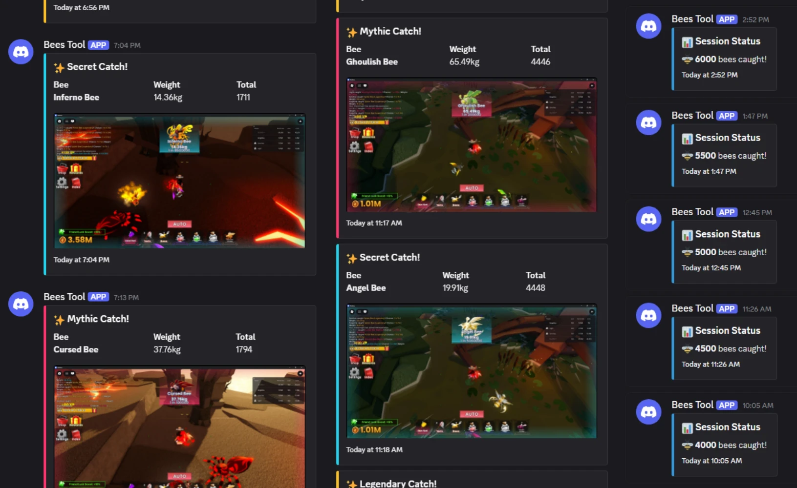

<div align="center">
<h1>Storage Hunters Tool</h1>
  <p>The definitive <b>Storage Hunters Macro</b> for <b>Roblox</b></p>
</div>

<div align="center">

[](LICENSE)
[](#)
[](#)
[](#)
[](#)

</div>

> *“In motu continuo, certitudo reperta est.”* — Riri, circa 2026

**Bees Tool** is a high-frequency, computer-vision-driven stabilization and execution utility architected for the [Bees](https://www.roblox.com/games/92528179587394) environment. It leverages a multi-stage template matching pipeline—optimized via downscaled bitmap interrogation and rotational caching—to achieve persistent locking on target entities.

Bees Tool relies on Windows Dynamic Link Libraries (WinDLLs) for core features and is only supported on machines running Windows.

<div align="center">
  <video src="https://github.com/user-attachments/assets/a52e705f-8d1c-443f-92c0-28d3d04041c7" width="100%" controls>
  </video>
  <!-- <video src="https://github.com/user-attachments/assets/8bbe6eb9-72fd-4d4d-9d34-9d73fb156ae2" width="100%" controls>
  </video> -->
  
</div>

-----

## 🚀 Core Features

* **Rotational Template Matching**: Utilizes high-frequency computer vision with rotational caching to maintain persistent target locking.
* **Performance-Optimized C-Core**: Offloads heavy pixel scanning to a C-based DLL.
* **Automated Catch Execution**: Handles the entire kinematic sequence from target identification to vector-calculated drag interaction.
* **Observationally Inferred Calibration**: Self-calibrating meter detection that adapts to your screen geometry and chromatic profile.
* **Autonomous Traversal Circuit**: Configurable movement patterns and swing cycles for fully unattended environmental interaction.
* **Real-Time Telemetry Overlay**: Non-intrusive visual feedback system displaying ROI status, lock confidence, and calibration bars.
* **OCR-Driven Reporting**: Integrated Windows OCR engine for parsing catch data, rarity detection, and weight tracking.
* **Discord Webhook Integration**: Asynchronous notification system for remote session monitoring and rarity alerts.
* **Intelligent Process Monitoring**: Automatic state management based on Roblox process health and network connectivity.
* **Hot-Reloadable Configuration**: On-the-fly JSON profile switching and in-app menu for real-time parameter tuning.

## 📥 Installation

### 📦 Prerequites

- Windows 10 or 11
- Python 3.10 or higher
- MSVC via Visual Studio 2022 or Visual Studio 2026

### 💻 Setup

1. Install **Python dependencies** and **AutoHotKey binary** via Pip:
   ```powershell
   pip install -r requirements.txt; if ($?) { pip install ahk[binary] }
   ```

2.  Compile the **C DLL(s)** via x64/x86 Native Tools Command Prompt for VS:
    ```cmd
    cl /LD src\native\core_vision.c /Fe:src\native\core_vision.dll
    ```
> [!IMPORTANT]
> You must compile the DLL for the same architecture as your Python interpreter. To check your version, run:  
>
> `python -c "import platform; print(platform.architecture()[0])"`

3.  Initialize the script via terminal:
    ```powershell
    python src\program.pyw
    ```

-----

## ⌨️ Controls

| Keybind                           | Action                                                                                               |
| :-------------------------------- | :--------------------------------------------------------------------------------------------------- |
| <kbd>F6</kbd>                     | **Toggle State**: Switches the tool between Active (Green) and Standby (Red).                        |
| <kbd>Ctrl</kbd> + <kbd>F10</kbd>  | **Menu Toggle**: Shows or hides the menu for importing, editing, and saving configurations           |
| <kbd>Shift</kbd> + <kbd>Esc</kbd> | **Termination**: Immediately closes the script and destroys all overlay windows.                     |
| <kbd>Ctrl</kbd> + <kbd>Shift</kbd> + <kbd>X</kbd> | **Cancel Shutdown**: Immediately aborts scheduled shutdown. |

## 🛠️ Configuration
Bees Tool is highly customizable. All performance profiles, automation behaviors, and Discord integration settings are handled via **Configuration Files** (`.json`). 

> [!TIP]
> For a full breakdown of every constant and how to tune them, please see:
>
> ➔ [CONFIGURATION.md](docs/CONFIGURATION.md)

-----

## 🖥️ Operational Logic

### The "Lock" Mechanism

Unlike primitive pixel-searchers, Bees Tool requires a **Stable Identification State**. Interaction occurs only when two conditions are met: **Temporal Stability** (the target persists for `LOCK_DURATION_MS`) and **Spatial Validity** (the target's orientation does not project a drag path outside the allowed `BOUNDARY_MARGIN`). This ensures that the tool does not "flick" to transient artifacts or UI debris.

### Telemetry Overlay

The script provides real-time visual feedback via a transparent Tkinter canvas. The **Region of Interest (ROI)** indicators communicate the current state:

* **Green ROI Points**: Tool is **Active/ON**. The system is actively interrogating the search domain.
* **Red ROI Points**: Tool is **Inactive/OFF**. Logic is suspended, though the overlay remains initialized.
* **Lime Circle**: Target identified; currently accumulating confidence.
* **Cyan Circle**: Target locked; lock duration threshold exceeded, interaction imminent.
* **Red Circle**: Target identified, but the calculated vector would exceed the Boundary Margin. Action suppressed.
* **Yellow Horizontal Bars**: Rendered only after successful calibration. These indicate the precise Y-axis and width where the tool is monitoring the peak of the meter.

-----

## ⚖️ Meter Automation & Observational Calibration

The **Auto Release** module is a specialized sub-system designed for the terminal phase of the interaction—the net release. Unlike conventional region-lock approaches where coordinate data is predefined, this system utilizes **Observationally Inferred Calibration**.

### The Calibration Phase

Upon initialization, the tool remains in a searching state for the meter interface (defined by `meter.png`). Rather than requiring static coordinates, the script performs a one-time, high-fidelity template match across the right hemisphere of the display.
Once the signature is identified, the system silently extracts the **spatial geometry and chromatic profile** of the interaction bar. It captures the exact Y-coordinate and a 4-pixel horizontal color sample to serve as a persistent reference.

### Optimized Execution Logic

The moment the rising green bar's color signature enters the performance-optimized interception zone, the tool issues an immediate `button='left', direction='up'` command, executing the swing at the apex of the meter.

## 🗺️ Auto Routine & Autonomous Traversal

The **Auto Routine** module extends the system beyond reactive execution into **structured environmental traversal**. Rather than remaining stationary between interactions, the tool performs a controlled movement cycle designed to periodically reposition the player and initiate new swing attempts.

### The Traversal Pattern

When enabled, the routine follows a deterministic **movement sequence** defined by `AUTO_ROUTINE_PATTERN`. Each vector in the pattern is applied sequentially, with the corresponding key held for `AUTO_ROUTINE_WALK_TIME_MS` before advancing to the next step. The pattern loops indefinitely, forming a continuous traversal circuit.

### Autonomous Swinging Cycle

After completing each movement step, the routine initiates a new swing attempt by issuing a sustained `button='left', direction='down'` command. This action hands control to the **Auto Release** subsystem, which performs calibration if necessary and manages the release timing during the swing.

If no minigame is detected within the interval defined by `AUTO_ROUTINE_LMB_TIMEOUT_MS`, the routine concludes the attempt and resumes traversal with the next movement vector. This cyclical process creates a fully autonomous loop of **movement, swinging, and execution**, allowing the system to operate continuously without manual repositioning.

-----

## 🛰️ Nomenclature & Phonetics

To maintain alignment with the architectural vision of the framework, the designation **Bees Tool** is to be phonetically rendered as **/biːs/** (*rhyming with "fleece" or "geese"*).

The voiced alveolar fricative **/biːz/** (as in the Hymenoptera insect) is considered a lexical deviation and will not be tolerated in formal interrogation or community discourse. Proper sibilance is a prerequisite for tool competency.

-----

## 📄 License

Storage Hunters Tool is provided as-is under the [MIT License](LICENSE).

Copyright (c) 2026 Riri
