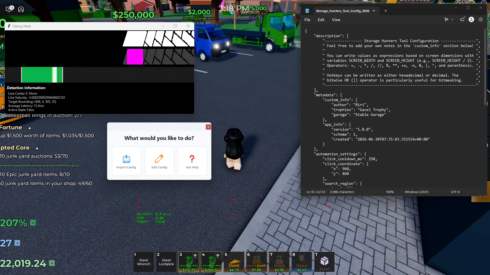
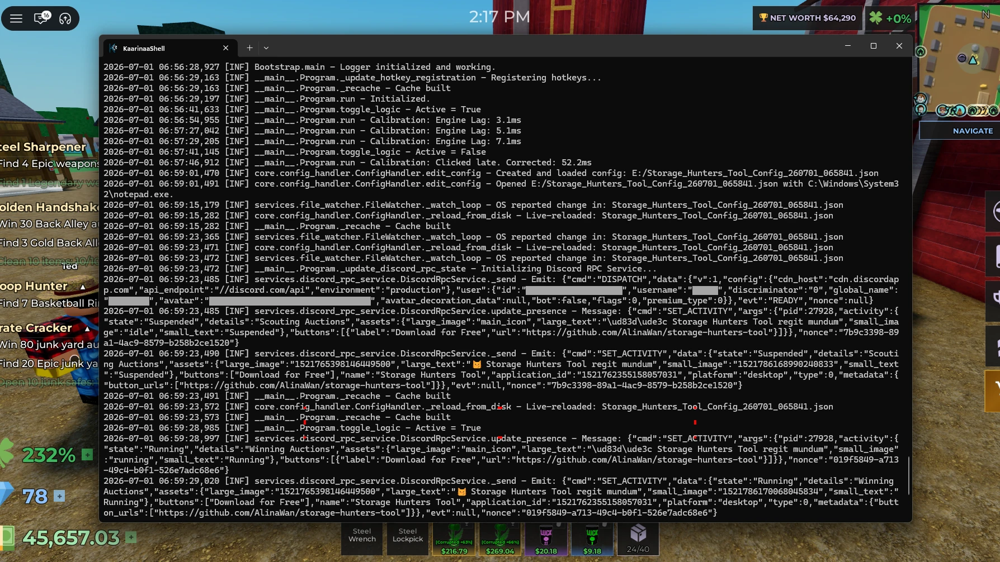

<div align="center">
<h1>Storage Hunters Tool</h1>
  <p>The definitive <b>Storage Hunters Macro</b> for <b>Roblox</b></p>
</div>

<div align="center">

[](LICENSE)
[](#)
[](#)
[](#)
[](#)
[](#)
[](#)

</div>

> *“Omnia moventur, unum congruit.”* — Riri, circa 2026

Storage Hunters Tool est instrumentum visionis computatralis ad executionem in tempore reali destinatum, constructum pro ambitu [Storage Hunters: Open World](https://www.roblox.com/games/98800969324557). Systema motum signi per continuum spatium observat et regionem propositam in eodem plano perpendit. Cum motus et regio in congruentiam veniunt, actio statim exercetur.

This project is built on an updated version of the Præstantia Summa Engine used in [Bees Tool](https://github.com/AlinaWan/bees-tool). The first commit of this project continues from [this](https://github.com/AlinaWan/bees-tool/commit/3fe1410c69087503c06fea75d267cc0d49bc91b9) commit.

Storage Hunters Tool relies on Windows Dynamic Link Libraries (WinDLLs) for core features and is only supported on machines running Windows.

## 📸 Showcase

<div align="center">
  <video src="https://github.com/user-attachments/assets/6af38b00-a857-42af-97e9-398640524714" alt="Demonstration Video" width="100%" controls>
  </video>
  
   
</div>

-----

## 📥 Installation

### 📦 Sine Qua Non

#### Software

- Windows 10 or 11
- Python 3.10 x86-64 or higher (3.14 recommended)
- Visual Studio 2022 or Visual Studio 2026
- Desktop development with C++ workload for Visual Studio containing:
  - Windows 10 or 11 SDK
  - MSVC (cl.exe)
  - MASM for x64 (ml64.exe)

#### Hardware

- A central x86-64 processor supporting the AVX2 instruction set
- A graphics processing unit supporting the DirectX 11 API

### 💻 Setup

1. Install **Python dependencies** via Pip:
   ```powershell
   pip install -r requirements.txt
   ```

2. Compile the **C++ & x86-64 Assembly files**:
   ```powershell
   .\build_native.cmd
   ```

3.  Initialize the script via terminal:
    ```powershell
    python -O program.pyw
    ```

#### Optional:

* Initialize the app for development or debugging:
   ```powershell
   $env:PYTHONFAULTHANDLER=1
   $env:ATTACHVSJITDEBUGGER=1
   python program.pyw
   ```
  The program will halt execution immediately after launch (before creating or orchestrating the application) and resume after a debugger is attached.

* Frame Provider:
  * Use BetterCam instead of DxgiCapture:  
    Our native DxgiCapture, written in C++, is the default frame provider for the Præstantia Summa 2 Engine. For convenience, you can use BetterCam without writing your own IFrameProvider, but the performance benchmark is lower.

      ```powershell
      pip install bettercam==1.0.0
      $env:FRAME_PROVIDER = "src.services.bettercam_frame_provider.BetterCamFrameProvider"
      ```

  * Use Python MSS instead of DxgiCapture (Not recommended):  
    Our native DxgiCapture, written in C++, is the default frame provider for the Præstantia Summa 2 Engine. You can still use Python MSS from the Præstantia Summa 1 Engine without writing your own IFrameProvider, but the performance benchmark is lower.

      ```powershell
      pip install mss==10.1.0
      $env:FRAME_PROVIDER = "src.services.python_mss_frame_provider.PythonMssFrameProvider"
      ```

-----

## ⌨️ Controls

| Keybind                           | Action                                                                           |
| :-------------------------------- | :------------------------------------------------------------------------------- |
| <kbd>F6</kbd>                     | **Toggle State**: Switches the tool between Active (Green) and Standby (Red).    |
| <kbd>F7</kbd>                     | **Toggle Debug**: Toggles the visibility of the detection mask debug window.     |
| <kbd>Shift</kbd> + <kbd>Esc</kbd> | **Termination**: Immediately closes the script and destroys all overlay windows. |
| <kbd>Ctrl</kbd> + <kbd>F10</kbd>  | **Menu Toggle**: Shows or hides the menu for importing, editing, and saving configurations. |

### Telemetry Overlay

The script provides real-time visual feedback via a transparent Tkinter canvas. The **Region of Interest (ROI)** indicators communicate the current state:

* **Green ROI Points**: Tool is **Active/ON**. The system is actively interrogating the search domain.
* **Red ROI Points**: Tool is **Inactive/OFF**. Logic is suspended, though the overlay remains initialized.
* **Debug Window Diagnostic Panes**: The debug menu (<kbd>F7</kbd>) deploys a real-time diagnostic suite divided into three specific visual feedback windows to verify the computer vision pipeline and analyze click timing accuracy:
  * **Pane 1: Binary Detection Mask**: Displays the raw Otsu binarization output. Valid pixels that pass the threshold filter appear as pure white against a black background.
  * **Pane 2: Target Box Assignment**: Highlights the isolated search clusters. Detected pixels are dimmed to dark gray, while the active bounding zone detected as the target area is colored in magenta.
  * **Pane 3: Persistent Freeze Frame Window**: Captures and freezes the game frame at the exact millisecond a click event is triggered.
    * **Pink Lines**: Represent the left and right boundaries (`snap_tx1`, `snap_tx2`) of the target area at the moment of execution.
    * **Red Line**: Marks the precise horizontal position (`fired_x`) where the tracking line was located when the click was sent.
    * **Yellow Line**: If stable, will populate later to show where the tracking line ultimately settled (`ended_x`) after system latency and engine lag took effect.

## 🛠️ Configuration
Storage Hunters Tool is highly customizable. All profiles and automation behaviors are handled via **Configuration Files** (`.json`). 

> [!TIP]
> For a full breakdown of every constant and how to tune them, please see:
>
> ➔ [CONFIGURATION.md](docs/CONFIGURATION.md)

-----

## ⚙️ Technical Specification

<details>
  <summary>Expand details</summary>

The Præstantia Summa 2 Engine used in this project significantly improves upon the Præstantia Summa 1 Engine used in [Bees Tool](https://github.com/AlinaWan/bees-tool):

 * Core Design Principles:
   * Follows the SOLID principles:
     * Follows the single-responsibility principle (SRP)
     * Follows the open/closed principle (OCP)
     * Follows the Liskov substitution principle (LSP)
     * Follows the interface segregation principle (ISP)
     * Follows the dependency inversion principle (DIP)
   * Follows interface-based architecture
   * Follows the .NET dispose pattern (stop/close/dispose)
   * Follows the factory method pattern
   * Follows the provider pattern
   * Follows the data transfer object (DTO) pattern
   * Follows the dependency injection (DI) pattern
   * Follows the inversion of control (IoC) principle
   * Follows the principle of least astonishment (POLA)

 * Core Engine Architecture:
   * Languages used:
     * Python
     * C++
     * x86-64 Windows Assembly
   * Factory-provider based logger with three standard logging providers:
     * ConsoleLoggerProvider
     * FileLoggerProvider
     * DiscordWebhookLoggerProvider
     * The logger factory, logger provider, and logging formatter are fully decoupled and abstracted, enabling you to swap in your own provider or formatter for logging to ELK Stack, CloudWatch, Splunk, etc.
     * Multiple providers can be added to the logger factory at the same time.
   * Single-responsibility application factory, application orchestrator, and application to manage lifecycle and controlled dependency injection.
   * OCP-compliant frame provider system is swappable without changing any business logic, provided your frame provider follows the IFrameProvider contract.
     * Our in-house C++ DXGI capture DLL can reach over 500 FPS in practice and is several times faster than BetterCam & Python MSS.
   * Zero-dependency architecture. To fight against bloat, supply chain attacks, and slow performance, the only third-party dependencies the Præstantia Summa 2 Engine uses are the heavily scrutinized & vetted NumPy and OpenCV libraries (although usage of these are also being minimized in favor of x86-64 Assembly procedures).
     * File drag-drop: Instead of TkinterDnD2, we use Shell32 & User32.
     * Discord rich presence: Instead of pypresence, we use Kernel32 & MemoryView.
     * Discord wekhooks: Instead of Requests, we use urllib.request.
     * Frame capture: Instead of Python MSS or BetterCam, we use DXGI & Direct3D 11 API via a C++ DLL.
     * Hotkey registration: Instead of keyboard, we use User32.
     * Input simulation: Instead of AHK or pynput, we use User32.
     * Math evaluator: Instead of simpleeval, we use ast.
     * Process monitoring: Instead of psutil, we use User32.
     * Directory monitoring: Instead of watchdog, we use Kernel32.
     * Window control: Instead of PyWin32, we use User32.
     * System control: We use AdvApi32 & Kernel32.
     * Message boxes: We use User32.
     * Interfaces: We use typing.Protocol.
   * The adherence to the core design principles is designed to make the engine easily reusable and separable from the application-specific implementation. For instance, services and monitors rely only on the caller to dictate what data to use, while the callee only handles it.

 * Storage Hunters Tool Application-Specific Architecture
   * threshold.asm uses register-based SIMD vectorization to bypass memory bus latency. Rather than transmitting signals across the bus, the threshold procedure reads from the XMM1 through XMM3 registers.

</details>

-----

## 🛰️ Nomenclature & Phonetics

To maintain alignment with the architectural vision of the framework, the designation **Storage Hunters Tool** is to be phonetically rendered as **/ˈstɔːrɪzː/** (*as in "charisma"*).

The voiced postalveolar affricate **/ˈstɔːrɪdʒ/** (as in a space or a place for storing) is considered a lexical deviation and will not be tolerated in formal interrogation or community discourse. Proper sibilance is a prerequisite for tool competency.

Users will find themselves experiencing a profound sense of gratitudo for the privilege of utilizing the (elongated) voiced alveolar fricative. (See: [Bees Tool](https://github.com/AlinaWan/bees-tool#%EF%B8%8F-nomenclature--phonetics))

-----

## 🫶 Acknowledgements

As with most of my macros, Storage Hunters Tool is influenced by [iamnotbobby](https://github.com/iamnotbobby)'s [Dig Tool](https://github.com/iamnotbobby/dig-tool), which I've been a part of in
the past. I feel the need to explicitly acknowledge this project in this specific macro due to Storage Hunters' minigame's glaring resemblance to the one in [DIG](https://www.roblox.com/games/126244816328678).
While all of the code is my own work, I owe some of the architectural choices to my experience with Dig Tool.

-----

## 📝 End Notes

[](https://discord.gg/EFDsph8EJF)

See Also:
 * Præstantia Summa Engine:
   * [Storage Hunters Tool](https://github.com/AlinaWan/storage-hunters-tool) for [Storage Hunters](https://www.roblox.com/games/98800969324557) 
   * [Bees Tool](https://github.com/AlinaWan/bees-tool) for [Bees](https://www.roblox.com/games/92528179587394) 
 * Other Tools:
   * [Mine Tool](https://github.com/AlinaWan/mine-tool) for [Mine](https://www.roblox.com/games/115694170181074)
   * [iamnotbobby](https://github.com/iamnotbobby)'s [Dig Tool](https://github.com/iamnotbobby/dig-tool) for [Dig](https://www.roblox.com/games/126244816328678)

-----

## 📄 License

Storage Hunters Tool is provided as-is under the [MIT License](LICENSE).

Copyright (c) 2026 Riri